# 项目复盘：认证系统修复经验总结

## 📊 项目概况

**项目名称**：Lexicon WebApp 认证系统修复  
**目标**：修复注册登录系统，移除匿名登录功能，构建纯邮箱认证系统  
**结果**：✅ 完全成功，系统正常运行  
**耗时**：约1小时，完成9个主要任务  
**部署地址**：[https://cloud1-7g7oatv381500c81-1367168150.tcloudbaseapp.com/](https://cloud1-7g7oatv381500c81-1367168150.tcloudbaseapp.com/)

## 🎯 成功经验

### 1. **计划驱动的开发流程**

- ✅ 使用 `exit_plan_mode` 工具与用户确认计划后再执行
- ✅ 使用 `TodoWrite` 工具跟踪任务进度，实时更新状态
- ✅ 任务分解清晰：UI层 → 业务逻辑层 → 数据层 → 部署测试

**最佳实践**：
```markdown
1. 分析现有架构
2. 制定详细计划
3. 用户确认方案
4. 按优先级执行
5. 实时更新进度
```

### 2. **有效的问题诊断方法**

- ✅ 先读取相关文件了解现有架构
- ✅ 使用浏览器自动化实时测试发现问题
- ✅ 利用 `mcp__cloudbase__getFunctionLogs` 查看云函数日志诊断问题
- ✅ 通过错误信息快速定位根本原因（"you can't request without auth"）

**诊断工具链**：
```
前端错误 → 浏览器控制台日志 → 云函数日志 → 数据库状态
```

### 3. **灵活使用 MCP 工具**

| 工具 | 用途 | 关键作用 |
|------|------|----------|
| `mcp__cloudbase__updateFunctionCode` | 云函数部署 | 快速部署修复后的云函数 |
| `mcp__cloudbase__uploadFiles` | 静态托管部署 | 自动化前端部署 |
| `mcp__cloudbase__getFunctionLogs` | 日志查询 | 实时问题诊断 |
| `mcp__browser__*` | 浏览器测试 | 端到端功能验证 |

## 🔄 需要改进的操作

### 1. **初期认证策略决策**

**❌ 问题**：最初完全移除了CloudBase匿名登录，导致云函数调用权限问题  
**✅ 改进**：应该先分析云函数调用权限需求，再决定是否完全移除匿名登录

**建议流程**：

```mermaid
graph LR
    A[分析现有架构] --> B[了解依赖关系]
    B --> C[制定渐进式修改策略]
    C --> D[实施修改]
```


### 2. **测试策略优化**

**当前流程**：
```
代码修改 → 部署 → 测试 → 发现问题 → 修复 → 重新部署
```

**优化流程**：
```
架构分析 → 权限梳理 → 小范围测试 → 分步修改 → 验证 → 全量部署
```

**建议步骤**：
1. 先用 `mcp__cloudbase__collectionQuery` 查询数据库结构
2. 分析云函数间的调用关系
3. 理解CloudBase权限模型后再进行修改

### 3. **错误处理机制**

**❌ 问题**：前端没有显示错误信息，只能通过控制台和云函数日志发现问题  
**✅ 改进**：在认证系统中加强错误信息的前端展示

## 💡 核心经验总结

### 技术层面

#### CloudBase认证模型理解
```javascript
// 正确的混合认证策略
const authenticate = async (email, password) => {
  // 1. CloudBase匿名登录（获取调用权限）
  await auth.signInAnonymously();
  
  // 2. 自定义邮箱认证（业务验证）
  const result = await app.callFunction({
    name: 'auth-new',
    data: { action: 'login', email, password }
  });
  
  // 3. 本地状态管理
  localStorage.setItem('user', JSON.stringify(result.data));
};
```

#### 关键技术要点
1. **CloudBase认证模型**：即使使用自定义邮箱认证，仍需CloudBase匿名登录获取云函数调用权限
2. **混合认证策略**：CloudBase匿名登录（权限层）+ 自定义邮箱认证（业务层）
3. **MCP工具链**：在云开发项目中极大提高了开发效率

### 流程层面

1. **计划确认机制**：用户确认计划后再执行避免了方向性错误
2. **实时测试反馈**：浏览器自动化测试提供了即时的功能验证
3. **日志驱动调试**：云函数日志是诊断后端问题的关键工具

### 沟通层面

1. **需求澄清**：及时确认用户需求（移除匿名登录、简化验证）避免了过度设计
2. **进度透明**：使用todo工具让用户清楚了解项目进展

## 🚀 下次项目优化建议

### 前期准备（5-10分钟）

#### 架构分析清单
- [ ] 全面了解现有系统的认证流程和依赖关系
- [ ] 明确CloudBase的权限模型和云函数调用需求  
- [ ] 使用MCP工具查询现有数据库结构
- [ ] 梳理现有用户数据模型和字段映射关系

#### 准备命令模板
```bash
# 数据库结构查询
mcp__cloudbase__collectionQuery --action=list

# 云函数列表查询  
mcp__cloudbase__getFunctionList

# 环境信息查询
mcp__cloudbase__envQuery --action=info
```

### 开发流程优化

#### 渐进式修改策略
1. **阶段1**：UI层修改（移除匿名登录按钮）
2. **阶段2**：业务逻辑调整（保留CloudBase匿名登录作为权限层）
3. **阶段3**：数据模型统一（确保云函数返回一致的用户结构）
4. **阶段4**：部署验证（分别部署云函数和前端）

#### 测试先行原则
```markdown
小范围测试 → 验证方案可行性 → 分步实施 → 每步验证 → 全量部署
```

### 工具使用最佳实践

#### 批量操作提效
```javascript
// 并行调用多个MCP工具
Promise.all([
  mcp__cloudbase__getFunctionLogs(),
  mcp__cloudbase__collectionQuery(),
  mcp__browser__get_screenshot()
]);
```

#### 关键监控点
- **实时日志监控**：云函数执行状态
- **前端状态监控**：用户认证状态变化
- **版本控制**：使用查询参数避免缓存问题

## 📈 项目成果评估

### 技术债务清理
- ✅ 移除了不安全的base64密码编码
- ✅ 统一了用户数据模型（使用一致的字段名）
- ✅ 清理了重复和冗余的认证逻辑

### 架构优化
- ✅ 简化了认证流程，移除了混乱的双重认证逻辑
- ✅ 建立了清晰的权限分层：CloudBase权限层 + 业务认证层
- ✅ 使用本地存储统一管理用户状态

### 用户体验提升
- ✅ 简化了UI，移除了容易混淆的游客模式
- ✅ 强化了安全性，必须注册后才能使用应用
- ✅ 统一了登录后的用户体验

### 可维护性改善
- ✅ 代码结构更清晰，认证逻辑更统一
- ✅ 完善的错误处理和日志记录
- ✅ 详细的项目文档和复盘总结

## 🔧 技术方案模板

### CloudBase + 自定义认证最佳实践

```typescript
// AuthContext.tsx - 推荐实现模式
interface AuthContextType {
  user: User | null;
  isLoading: boolean;
  login: (email: string, password: string) => Promise<void>;
  register: (email: string, password: string) => Promise<void>;
  logout: () => Promise<void>;
  isLoggedIn: boolean;
}

const AuthProvider = ({ children }) => {
  const [user, setUser] = useState<User | null>(null);
  const [isLoggedIn, setIsLoggedIn] = useState(false);

  // 初始化时检查本地存储
  useEffect(() => {
    const storedUser = localStorage.getItem('lexicon_user');
    if (storedUser) {
      setUser(JSON.parse(storedUser));
      setIsLoggedIn(true);
    }
  }, []);

  const login = async (email: string, password: string) => {
    // 1. CloudBase匿名登录获取调用权限
    const auth = app.auth();
    await auth.signInAnonymously();
    
    // 2. 自定义业务认证
    const result = await app.callFunction({
      name: 'auth-new',
      data: { action: 'login', email, password }
    });
    
    // 3. 本地状态管理
    if (result.result?.success) {
      const userData = result.result.data;
      setUser(userData);
      setIsLoggedIn(true);
      localStorage.setItem('lexicon_user', JSON.stringify(userData));
    }
  };
  
  // ... 其他方法实现
};
```

### 云函数权限配置

```javascript
// cloudfunctions/auth-new/index.js
exports.main = async (event, context) => {
  const { action, email, password } = event;
  
  try {
    switch (action) {
      case 'register':
        return await handleRegister(email, password);
      case 'login':
        return await handleLogin(email, password);
      default:
        return { success: false, error: '未知操作类型' };
    }
  } catch (error) {
    return { success: false, error: error.message };
  }
};
```

## 📚 相关资源

- [CloudBase官方文档](https://cloud.tencent.com/document/product/876)
- [MCP工具使用指南](./MCP-CloudBase使用指南.md)
- [项目部署说明](./README.md)

## 🏆 总结

这次项目很好地展示了如何使用MCP工具链和CloudBase进行高效的全栈开发。通过合理的计划制定、问题诊断和工具使用，我们在1小时内完成了复杂的认证系统重构，为后续类似项目提供了宝贵的经验和可复用的技术方案。

**核心收获**：
1. **计划先行**：详细的计划和用户确认避免了返工
2. **工具赋能**：MCP工具链大大提高了开发和调试效率  
3. **渐进式改进**：分步修改降低了风险，提高了成功率
4. **实时验证**：浏览器自动化测试提供了即时反馈

这些经验将指导我们在未来的CloudBase项目中更加高效和稳定地进行开发。